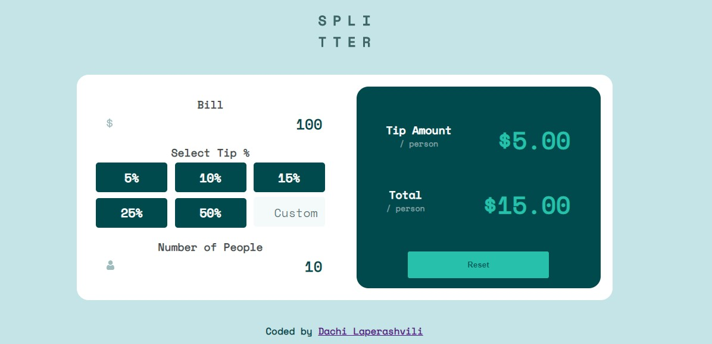
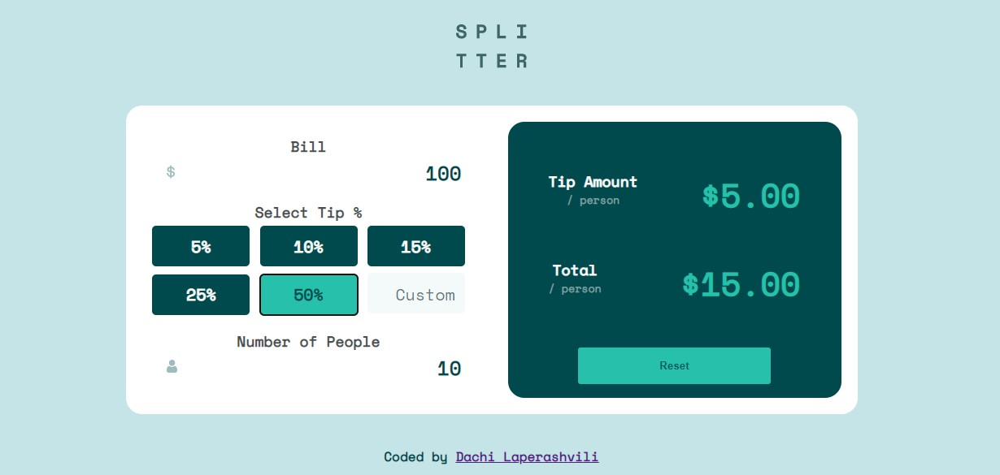
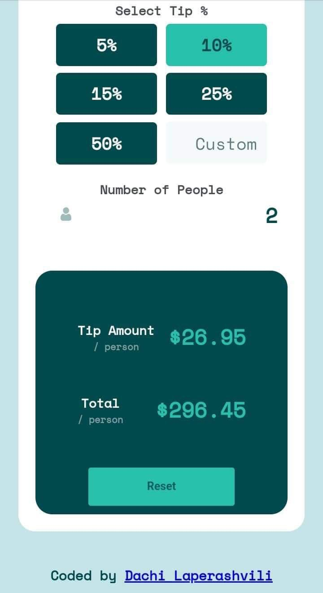

# Frontend Mentor - Tip calculator app

### The challenge

Users should be able to:

- View the optimal layout for the app depending on their device's screen size
- See hover states for all interactive elements on the page
- Calculate the correct tip and total cost of the bill per person

### Screenshot

### Links

- Solution URL: https://github.com/Dachi-Laperashvili/tip-calculator
- Live Site URL: https://dachi-laperashvili.github.io/tip-calculator/

## My process

### Built with

- JavaScript
- CSS
- HTML

### Useful resources

- [parseFloat()] - this helped me to do calculations on only numbers from value

## Author

- Website - [Dachi Laperashvili](https://github.com/Dachi-Laperashvili)
